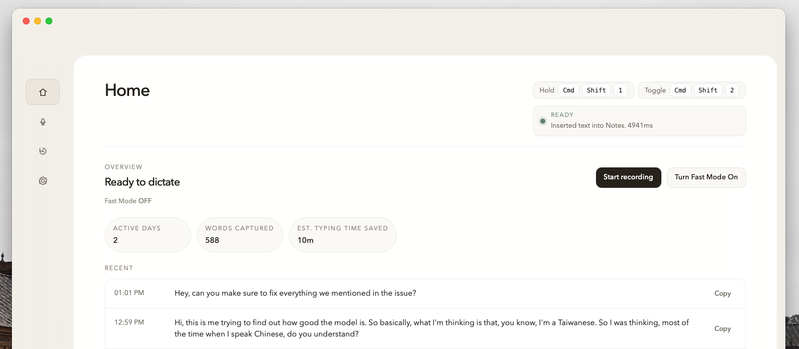

# Typeless Lite

Open-source desktop dictation for macOS.

Built for one job: press a global shortcut, speak, and get clean text inserted back into the app you were already using.



## What it does

- two real shortcuts:
  - `Hold to speak`
  - `Hands-free start/stop`
- Whisper-compatible transcription
- optional LLM cleanup / formatting
- paste back into the previously active app or terminal
- transcript history with search and copy
- onboarding for microphone and Accessibility permissions

## Who it is for

- people who want a Typeless / Wispr Flow style tool they can run themselves
- people who want control over models, prompts, API base URL, and shortcuts
- people who want a cleaner desktop app instead of a settings-heavy dashboard

## Quick start

Requirements:

- macOS
- Node.js 20+
- Rust 1.77+

Run locally:

```bash
yarn install
yarn tauri:dev
```

Build:

```bash
yarn tauri:build
```

## Permissions

- `Microphone`
- `Accessibility`

Accessibility is required for cross-app text insertion.

## Config

- API key
- API base URL
- Whisper model
- formatter model and prompt
- custom vocabulary
- hold shortcut
- hands-free shortcut
- language
- fast mode

## Repo layout

- `src/` frontend
- `src-tauri/src/main.rs` desktop runtime and native insertion
- `src-tauri/icons/` native app icons

## Notes

- API keys are user-provided and stored locally.
- The repo includes a Cargo workaround in `.cargo/config.toml` for the Intel macOS `zerocopy` AVX512 `E0658` issue.
