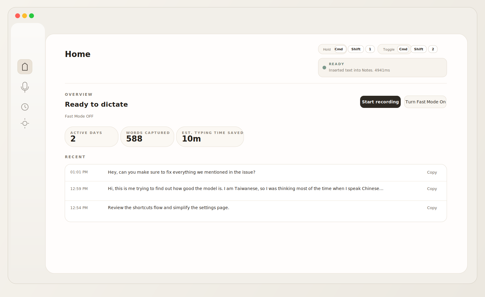
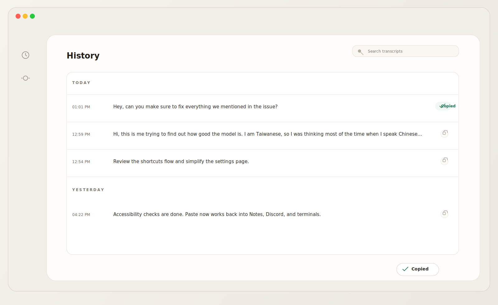

# Typeless Lite

<p align="center">
  <strong>Open-source desktop dictation for macOS.</strong>
</p>

<p align="center">
  Press a hotkey, speak naturally, and get clean text inserted back into whatever app you were already using.
</p>

<p align="center">
  A build-it-yourself alternative to Typeless and Wispr Flow.
</p>

<p align="center">
  macOS · Tauri · Rust · TypeScript · Whisper transcription · Bring your own API
</p>

<p align="center">
  
</p>

## Why this exists

Most desktop dictation tools either feel like enterprise software, hide core behavior behind subscriptions, or make simple settings feel heavier than the product itself.

Typeless Lite takes the opposite approach:

- two real global shortcuts: hold to speak and hands-free
- fast Whisper transcription with optional LLM cleanup
- text goes back into the app or terminal you were using before
- a calm desktop UI instead of a dashboard full of controls
- local control over prompts, models, API base URL, and vocabulary

## What it does

- Global hotkey recording with both modes built in:
  - `Hold to speak`
  - `Hands-free start/stop`
- Whisper-compatible transcription via `/v1/audio/transcriptions`
- Optional cleanup/formatting via `/v1/chat/completions`
- Paste back into the previously active app, with terminal-aware fallbacks
- macOS Accessibility permission checks and onboarding
- Transcript history with search and one-click copy
- Fast Mode when you want lower latency
- Language selection and custom vocabulary

## Screens

<p align="center">
  
</p>

<p align="center">
  
</p>

## How it works

1. Trigger dictation with either `Hold to speak` or `Hands-free`.
2. Speak from anywhere on macOS.
3. Transcribe with Whisper and optionally run cleanup/formatting.
4. Insert the final text back into the app that was active when dictation started.
5. Keep a searchable transcript history locally inside the app.

## Quick start

Prerequisites:

- Node.js 20+
- Rust 1.77+
- macOS

Install and run:

```bash
yarn install
yarn tauri:dev
```

Build a production app:

```bash
yarn tauri:build
```

## Required macOS permissions

1. `Microphone`
   System Settings -> Privacy & Security -> Microphone

2. `Accessibility`
   System Settings -> Privacy & Security -> Accessibility

Accessibility is required for cross-app insertion and paste automation.

## Main settings

- API key
- API base URL
- Whisper model
- Formatter model and prompt
- Custom vocabulary
- Hold shortcut
- Hands-free shortcut
- Default language
- Fast Mode / formatter toggle
- Clipboard context

## Project structure

- `src/` frontend (Vite + TypeScript)
- `src-tauri/src/main.rs` desktop runtime and native insertion logic
- `src-tauri/icons/` native app icons
- `docs/` notes, iterations, and reference material

## Security

- API keys are user-provided and stored locally.
- No secrets are hardcoded in the repo.
- Clipboard context is optional and only sent when formatting is enabled.

## Notes

- This repo includes a root Cargo cfg override in `.cargo/config.toml` for the Intel macOS `zerocopy` AVX512 `E0658` issue.
- The README visuals are repo-hosted product previews. If you want to swap in real PNG screenshots later, drop them into `docs/github/` and update the image paths above.
