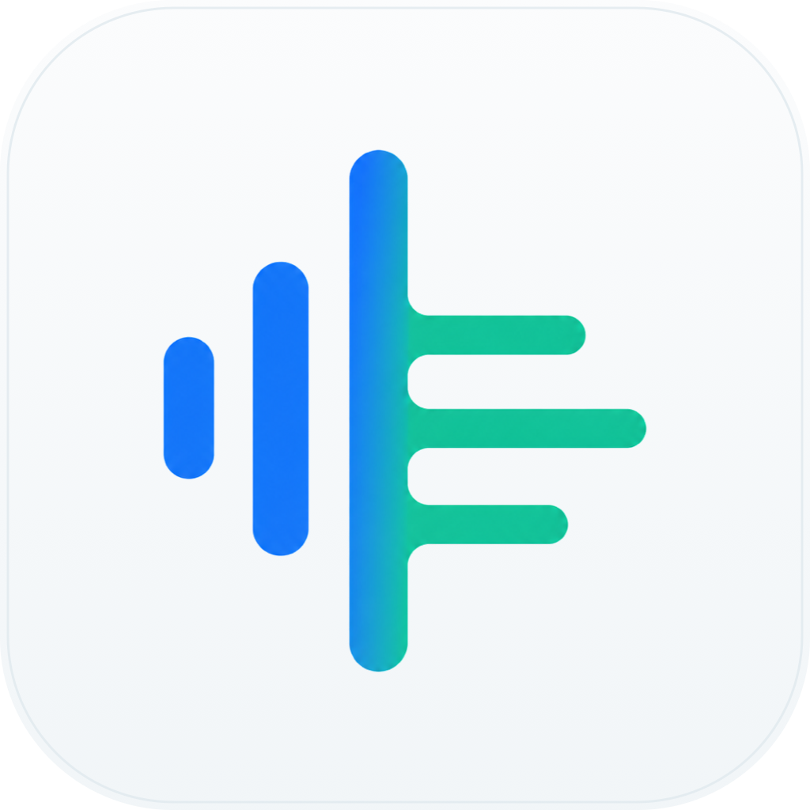

<p align="center">
  
</p>

<h1 align="center">verba</h1>

Verba is a macOS desktop dictation app. Press a shortcut, speak, and insert the transcript back into the app you were using.

## Run Locally

Requirements:

- macOS
- Node.js 20+
- Rust 1.77+
- Yarn 1.x

Install dependencies:

```bash
yarn install
```

Start the dev app:

```bash
yarn tauri:dev
```

## Build

Create the macOS app and DMG:

```bash
yarn tauri:build
```

The DMG is written to:

```text
src-tauri/target/release/bundle/dmg/
```

## Permissions

Verba needs:

- Microphone, to record speech
- Accessibility, to insert text into other apps

In dev mode, macOS grants these permissions to the terminal app running `yarn tauri:dev`, such as Warp or Terminal.
